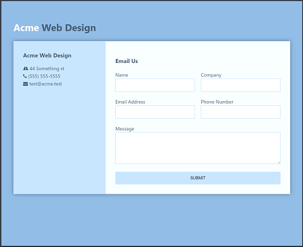

# Simple App to Send Emails using Nodemailer
This project is the result of my code-along to the Nodemailer App: [Nodemailer - Send Emails From Your Node.js App](https://www.youtube.com/watch?v=nF9g1825mwk) by *Brad Traversy*.  The app uses [Nodemailer](https://nodemailer.com) to send emails using a contact form rendered by the EJS view engine.

   

## Versions
* Express v4.16.2
* Node v9.7.1
* Nodemailer v4.6.2

## Installation
1. Clone this repo `git clone https://github.com/stanleyeosakul/node-contactform.git`
1. `cd` into the folder of the cloned repo
1. Run `yarn install` to install dependencies
1. Set your SMTP client and mailOptions in `app.js`
1. Run `node app.js`, and navigate to `http://localhost:3000/`